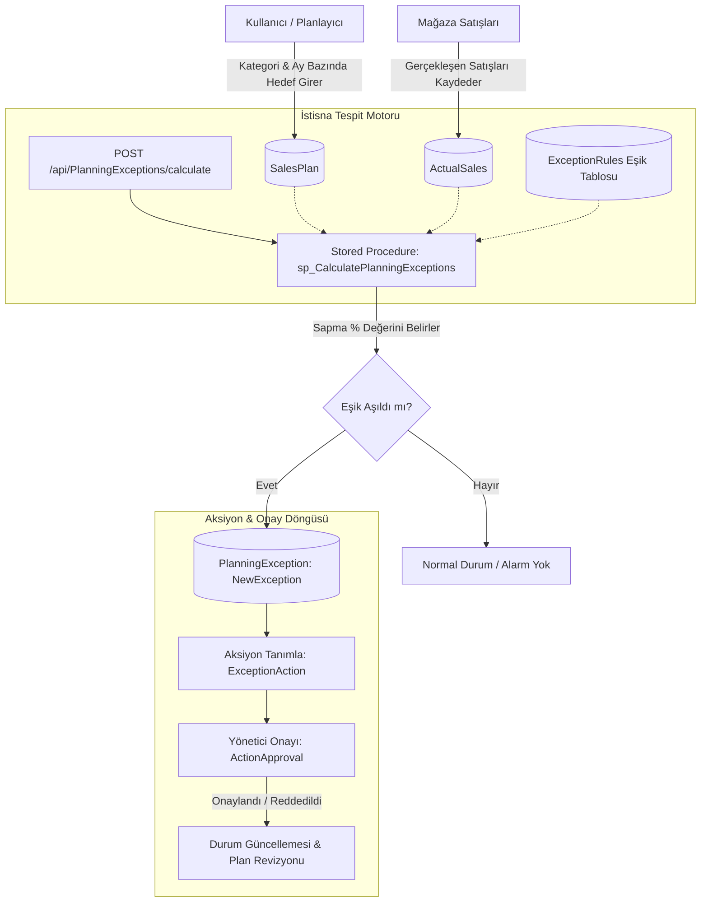

# 📊 Planning & Exception Management System (PoC)

<p align="center">
  
  
  
  
  
  
  
  
</p>

---

## 📌 Proje Genel Bakış ve Amaç

**Planning and Exception Management System**, perakende ve mağazacılık (merchandise/retail planning) sektöründe satış hedefleri ile gerçekleşen satış rakamları arasındaki sapmaları anlık olarak tespit eden, dinamik kurallara göre alarmlar üreten ve bu sapmalara karşı aksiyon/onay mekanizması işleten bir **Proof of Concept (PoC)** kurumsal yazılım çözümüdür.

Bu proje, **staj dönemi kapsamında** kurumsal yazılım mimarilerine, kurumsal tasarım desenlerine (Design Patterns) ve modern web standartlarına tam uyumlu olarak geliştirilmiştir. Projenin ana hedefi; büyük veri hacimlerinde gerçekleşen satış sapmalarını veritabanı seviyesinde optimize edilmiş prosedürlerle işlemek, katmanlı bir RESTful Web API ile servis etmek ve yöneticilerin onay süreçlerini yönetebileceği modern bir arayüz ile karar destek mekanizması sunmaktır.

---

## 🚀 Öne Çıkan Özellikler

- **Hibrit Veritabanı Mimarisi (Code-First & DB-First):** Mevcut ana veri tabloları (Markalar, Kategoriler, Envanter) DB-First olarak korunurken, planlama, istisna ve onay sistemleri Code-First yaklaşımı ile modellenmiştir.
- **Yüksek Performanslı Hesaplama Motoru (Stored Procedure):** Planlanan hedefler ile gerçekleşen satış kârlarını dinamik eşik değerlerine (`ExceptionRules`) göre MSSQL üzerinde `sp_CalculatePlanningExceptions` prosedürü ile kıyaslar.
- **Otomatik Sapma ve Alarm Tespiti:** Tolerans sınırlarını aşan negatif veya pozitif sapmalar anında `PlanningException` olarak kaydedilir.
- **Uçtan Uca Aksiyon ve Onay Mekanizması:** İstisnalara yönelik düzeltici aksiyonlar (`ExceptionAction`) tanımlanabilir ve yetkili amirlerin onayına (`ActionApproval`) sunulur.
- **Merkezi Standart API Yanıt Zarfı (`BaseResponse<T>`):** Tüm API yanıtları; durum kodu, mesaj, veri ve hata listesini içeren standart bir şablonla döner.
- **Global İstisna Yönetim Middleware'i (`UseCustomExceptionHandler`):** Sistem genelinde fırlatılan özel istisnalar (`NotFoundException`, `BadRequestException`, `DbUpdateException`) merkezi olarak yakalanır ve anlamlı HTTP yanıtlarına dönüştürülür.
- **Rol Tabanlı Kimlik Doğrulama (Basic Auth & RBAC):** Kullanıcı ve yönetici rollerine göre ayrıştırılmış erişim kontrolü.
- **Modern Dashboard & KPI Arayüzü:** Next.js 16, TypeScript ve Tailwind CSS ile geliştirilmiş görsel gösterge paneli.

---

## 🛠️ Kullanılan Teknolojiler ve Araçlar

### Backend & Veritabanı
| Teknoloji | Açıklama |
| :--- | :--- |
| **.NET 8 (C# 12)** | Yüksek performanslı ve ölçeklenebilir Web API altyapısı |
| **ASP.NET Core Web API** | RESTful mimari standartlarında API servisleri |
| **Entity Framework Core 8.0** | ORM, Linq sorguları ve Migration yönetimi |
| **Microsoft SQL Server (MSSQL)** | İlişkisel veritabanı ve Stored Procedure motoru |
| **DevExpress XPO Data Libraries** | Kurumsal veri işleme ve PLinq yardımcıları |
| **Swashbuckle (Swagger/OpenAPI)** | İnteraktif API dokümantasyonu ve test arayüzü |

### Frontend (Yönetim Paneli)
| Teknoloji | Açıklama |
| :--- | :--- |
| **Next.js 16 (App Router)** | Sunucu taraflı ve istemci taraflı modern React çatısı |
| **React 19 & TypeScript** | Tip güvenli bileşen mimarisi ve arayüz mantığı |
| **Tailwind CSS v4** | Modern, responsive ve utility-first stillendirme |
| **Lucide React** | Dashboard ve navigasyon ikon kütüphanesi |
| **React Hot Toast** | Kullanıcı dostu bildirim ve bildiri sistemi |

---

## 🏛️ Mimari ve Proje Yapısı

Çözüm, **SoC (Separation of Concerns - Sorumlulukların Ayrılığı)** ve **Katmanlı Mimari (N-Tier Architecture)** prensipleri benimsenerek 4 ana backend projesi ve 1 frontend projesinden oluşturulmuştur:

```plaintext
PlanningAndExceptionSystem/
│
├── PlanningAndExceptionSystem/           # [Sunum / Web API Katmanı]
│   ├── Controllers/                      # REST API Uç Noktaları (CustomBaseController türevleri)
│   ├── Security/                         # BasicAuthenticationHandler & Güvenlik
│   ├── UseCustomExceptionHandler.cs      # Global Exception Handler Middleware
│   ├── Program.cs                        # DI Container, Pipeline & Middleware Konfigürasyonu
│   └── appsettings.json                  # Bağlantı dizgeleri ve ortam ayarları
│
├── PlanningAndExceptionSystem.Services/  # [İş Mantığı Katmanı (Business Logic Layer)]
│   ├── Interfaces/                       # Servis arayüzleri (IPlanningExceptionService, vb.)
│   ├── Services/                         # Concrete servisler (ActualSalesService, vb.)
│   └── Exceptions/                       # Domain'e özel hata sınıfları (NotFound, BadRequest)
│
├── Repositories/                         # [Veri Erişim Katmanı (Data Access Layer)]
│   ├── Interfaces/                       # IGenericRepository, IUnitOfWork, IPlanningExceptionRepository
│   └── Repositories/                     # GenericRepository, UnitOfWork, Stored Procedure çağrıları
│
├── PlanningAndExceptionSystem.Models/    # [Domain / Varlık Katmanı (Core & Data Layer)]
│   ├── CodeFirst/                        # Code-First Varlıkları (PlanningException, SalesPlan, vb.)
│   ├── DbFirst/                          # Db-First Varlıkları (Brand, Category, Inventory)
│   ├── AppDbContext.cs                   # Ana DbContext (Hibrit konfigürasyon & NoAction Foreign Keys)
│   ├── BaseEntity.cs                     # Ortak alanlar (Id, CreatedDate, UpdatedDate)
│   ├── BaseResponse.cs                   # Standartlaştırılmış API Envelope sınıfı
│   └── Migrations/                       # EF Core Migration dosyaları
│
└── frontend/                             # [Modern Next.js 16 Dashboard]
    ├── app/                              # App Router sayfaları (dashboard, plans, actions, sales, vb.)
    ├── components/                       # Yeniden kullanılabilir UI bileşenleri
    └── services/                         # Axios/Fetch API istemcileri
```

---

## 🔄 İş Akışı ve İstisna Yönetimi Mantığı



### Stored Procedure (`sp_CalculatePlanningExceptions`) Rolü
- İlgili planlama ayı ve kategorisi için `SalesPlan.TargetProfit` ile `ActualSales.Profit` toplamlarını aggregate eder.
- Yüzdesel kâr sapmasını hesaplar:  
  $$\text{ActualDeviation} = \frac{\text{Gerçekleşen Kâr} - \text{Hedef Kâr}}{\text{Hedef Kâr}} \times 100$$
- `ExceptionRules` tablosundaki aktif kuralları (örneğin `% -10` veya `% -20` altı sapmalar) kontrol eder.
- Kuralı ihlal eden durumlar için `PlanningExceptions` tablosuna `NewException` (0) statüsüyle kayıt atar.

---

## ⚙️ Kurulum ve Çalıştırma Adımları

### 1. Ön Gereksinimler
- [.NET 8.0 SDK](https://dotnet.microsoft.com/download/dotnet/8.0)
- [Microsoft SQL Server](https://www.microsoft.com/sql-server/) (LocalDB, Express veya Developer Edition)
- [Node.js](https://nodejs.org/) (v18.0 veya üzeri)
- [Git](https://git-scm.com/)

### 2. Projeyi Klonlayın
```bash
git clone https://github.com/Baki-Yilmaz/PlanningAndExceptionSystem.git
cd PlanningAndExceptionSystem
```

### 3. Veritabanı Bağlantısını Yapılandırın
`PlanningAndExceptionSystem/appsettings.json` dosyasını açarak SQL Server bağlantı dizginizi (`DefaultConnection`) güncelleyin:

```json
{
  "ConnectionStrings": {
    "DefaultConnection": "Server=localhost\\SQLEXPRESS;Database=MiniMerchandiseDb;Trusted_Connection=True;TrustServerCertificate=True;"
  }
}
```

### 4. Migration'ları Uygulayın
Veritabanı tablolarını otomatik olarak oluşturmak için Web API klasöründeyken terminalde şu komutu çalıştırın:

```bash
dotnet ef database update --project ../PlanningAndExceptionSystem.Models --startup-project .
```

### 5. Stored Procedure'ü Oluşturun
MSSQL veritabanınızda (`MiniMerchandiseDb`) sapma hesaplama prosedürünü derleyin:

```sql
CREATE OR ALTER PROCEDURE sp_CalculatePlanningExceptions
AS
BEGIN
    SET NOCOUNT ON;

    INSERT INTO PlanningExceptions (SalesPlanId, ExceptionRuleId, ActualDeviation, Status, IsActionTaken, CreatedDate)
    SELECT 
        sp.Id AS SalesPlanId,
        er.Id AS ExceptionRuleId,
        CAST(((ISNULL(act.TotalProfit, 0) - sp.TargetProfit) / NULLIF(sp.TargetProfit, 0)) * 100.0 AS DECIMAL(18,2)) AS ActualDeviation,
        0 AS Status, -- NewException
        0 AS IsActionTaken,
        GETDATE() AS CreatedDate
    FROM SalesPlans sp
    CROSS JOIN ExceptionRules er
    OUTER APPLY (
        SELECT SUM(Profit) AS TotalProfit
        FROM ActualSales s
        WHERE s.PlanningMonthsId = sp.PlanningMonthsId
    ) act
    WHERE er.IsActive = 1
      AND NOT EXISTS (
          SELECT 1 FROM PlanningExceptions pe 
          WHERE pe.SalesPlanId = sp.Id AND pe.ExceptionRuleId = er.Id
      )
      AND (
          (er.Operator = '<' AND (((ISNULL(act.TotalProfit, 0) - sp.TargetProfit) / NULLIF(sp.TargetProfit, 0)) * 100.0) < er.ThresholdPercentage)
          OR
          (er.Operator = '>' AND (((ISNULL(act.TotalProfit, 0) - sp.TargetProfit) / NULLIF(sp.TargetProfit, 0)) * 100.0) > er.ThresholdPercentage)
      );
END;
```

### 6. Backend API'yi Başlatın
```bash
cd PlanningAndExceptionSystem
dotnet run
```
API varsayılan olarak `https://localhost:7195` veya `http://localhost:5000` portlarında ayağa kalkar.  
Swagger arayüzüne tarayıcınızdan erişebilirsiniz:  
👉 **`https://localhost:7195/swagger`**

### 7. (Opsiyonel) Frontend Dashboard'u Başlatın
```bash
cd frontend
npm install
npm run dev
```
Dashboard arayüzü `http://localhost:3000` adresinde çalışacaktır.

---

## 📡 API Endpoint ve Yanıt Örnekleri

Tüm uç noktalar `BaseResponse<T>` standart yanıt sarmalayıcısını kullanır.

### Standart Başarılı Yanıt Formatı:
```json
{
  "success": true,
  "message": "İşlem Başarılı",
  "data": { ... },
  "errors": null
}
```

### Standart Hata Yanıt Formatı:
```json
{
  "success": false,
  "message": "İşlem BAŞARISIZ!!!",
  "data": null,
  "errors": [
    "Product için 99 ID'sine sahip kayıt bulunamadı!"
  ]
}
```

---

### Örnek İstekler

#### 1. İstisnaları Hesaplama Motorunu Tetikleme
- **Endpoint:** `POST /api/PlanningExceptions/calculate`
- **Açıklama:** Veritabanındaki `sp_CalculatePlanningExceptions` prosedürünü tetikleyerek yeni sapma alarmlarını oluşturur.
- **Yanıt:**
```json
{
  "success": true,
  "message": "İşlem Başarılı",
  "data": null,
  "errors": null
}
```

#### 2. Tespit Edilen Sapmaları Listeleme
- **Endpoint:** `GET /api/PlanningExceptions`
- **Yanıt:**
```json
{
  "success": true,
  "message": "İşlem Başarılı",
  "data": [
    {
      "id": 1,
      "salesPlanId": 4,
      "exceptionRuleId": 1,
      "actualDeviation": -18.50,
      "status": 0,
      "isActionTaken": false,
      "createdDate": "2026-08-25T14:30:00"
    }
  ],
  "errors": null
}
```

#### 3. Satış Planı Ekleme
- **Endpoint:** `POST /api/SalesPlan`
- **İstek Gövdesi:**
```json
{
  "salesPlanCode": "PLAN-2026-AUG-SHOE",
  "targetProfit": 400000.00,
  "userId": 1,
  "planningMonthsId": 8,
  "categoryId": 2
}
```

#### 4. Gerçekleşen Satış Ekleme (Otomatik Kâr Hesaplamalı)
- **Endpoint:** `POST /api/ActualSales`
- **İstek Gövdesi:**
```json
{
  "shopId": 1,
  "productId": 5,
  "planningMonthsId": 8,
  "soldQuantity": 150
}
```
*(Backend servisi ürünün birim alış ve satış fiyatını çekerek `TotalAmount`, `TotalCost` ve net `Profit` değerlerini otomatik hesaplar).*

#### 5. Aksiyon Onaylama
- **Endpoint:** `POST /api/ActionApprovals`
- **İstek Gövdesi:**
```json
{
  "exceptionActionId": 3,
  "approvedById": 1,
  "approvalStatus": "Approved"
}
```
*(Onay kaydı oluşturulurken ilişkili `ExceptionAction` kaydının durumu da otomatik güncellenir).*

---

## 🛡️ Hata ve İstisna Yönetimi

Sistemde fırlatılan özel iş kuralı istisnaları, `UseCustomExceptionHandler` middleware'i sayesinde merkezi olarak karşılanır:

- `NotFoundException` $\rightarrow$ **404 Not Found**
- `BadRequestException` $\rightarrow$ **400 Bad Request**
- `DbUpdateException` $\rightarrow$ **İlişkisel Veri / Foreign Key Hatası Güvenli Mesajı**
- Beklenmeyen Genel Hatalar $\rightarrow$ **500 Internal Server Error** ve ILogger loglaması

---

## 👨‍💻 Geliştirici Bilgisi & Staj Notu

Bu proje, **Baki Yılmaz** tarafından staj programı kapsamında kurumsal yazılım geliştirme standartları, ilişkisel veritabanı optimizasyonu ve modern API mimarileri tecrübe edilerek geliştirilmiştir.

- **Geliştirici:** Baki Yılmaz
- **E-Posta:** [bakiyilmaz04@gmail.com](mailto:bakiyilmaz04@gmail.com)
- **GitHub:** [@Baki-Yilmaz](https://github.com/Baki-Yilmaz)
- **Proje:** Planning & Exception Management System (PoC)

---

## 📄 Lisans

Bu proje eğitim ve konsept kanıtlama (Proof of Concept) amacıyla geliştirilmiştir. Tüm hakları saklıdır.